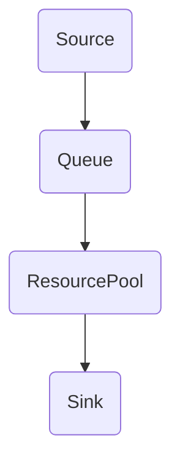

# Anylogic - Ejercicio 3 - Simulación de una Tienda con Filas de Clientes

## Modelos de Simulación

---

## Descripción del problema

Supongamos que tenemos una tienda con una sola caja registradora. Los clientes llegan a la tienda de acuerdo con un proceso de Poisson con una tasa de llegada λ (clientes por hora). Cuando llega un cliente, si la caja registradora está libre, el cliente es atendido inmediatamente. Si la caja está ocupada, el cliente se une a la fila de espera. Supongamos que el tiempo que tarda un empleado en atender a un cliente es una variable aleatoria exponencial con una tasa μ (clientes por hora). Queremos simular esta tienda durante un día de trabajo (8 horas), con λ = 10 y μ = 12.

## Implementación en AnyLogic

### Paso 1: Crear un nuevo modelo de simulación de eventos discretos
Inicie AnyLogic y cree un nuevo modelo de Simulación de Eventos Discretos. Puedes nombrar el modelo "Simulación de Tienda".

### Paso 2: Configurar los parámetros
Agregue dos parámetros al modelo: `arrivalRate` y `serviceRate`, que representan λ y μ, respectivamente. Establezca sus valores en 10 y 12.

### Paso 3: Agregar una fuente, una cola, un recurso y un fregadero
Agregue una `Source` (Fuente), una `Queue` (Cola), una `ResourcePool` (Pool de Recursos) y un `Sink` (Fregadero) al espacio de trabajo del modelo.

Configura la `Source` para generar entidades (clientes) de acuerdo con un proceso de Poisson con una tasa igual a `arrivalRate`. 

Configura la `Queue` para almacenar entidades que esperan ser atendidas. 

En la `ResourcePool`, configura para tener un solo recurso (caja registradora) y configura el tiempo de servicio como una variable aleatoria exponencial con una tasa igual a `serviceRate`.

Finalmente, las entidades que han sido atendidas deben ser enviadas al `Sink`.

### Paso 4: Conectar los bloques
Utiliza los conectores para conectar la `Source` a la `Queue`, la `Queue` a la `ResourcePool`, y la `ResourcePool` al `Sink`.

### Paso 5: Configurar la duración de la simulación
En las propiedades de la simulación, establece la duración de la simulación en 8 horas.

### Paso 6: Ejecutar la simulación
Haz clic en el botón de ejecución para iniciar la simulación.

## Diagrama de Flujo

