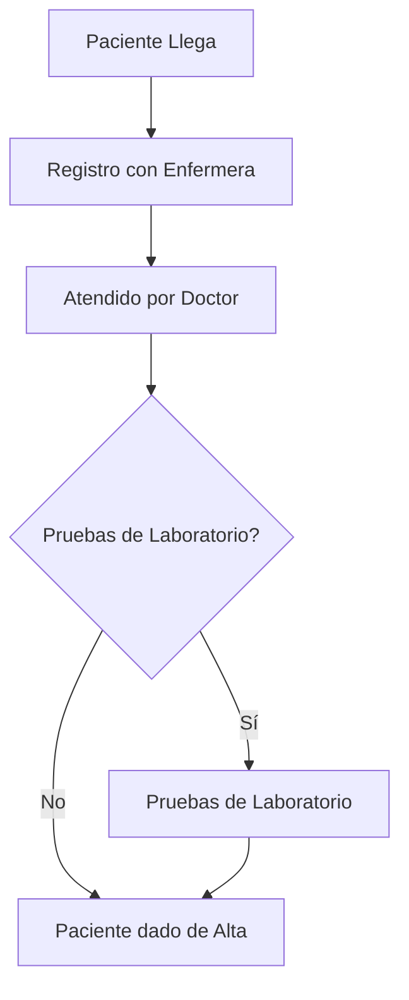

# Anylogic - Ejercicio 4 - Simulación de un Hospital

## Modelos de Simulación

---

## Descripción del Problema

Supongamos que tienes un hospital con la siguiente configuración:

- El hospital tiene tres tipos de personal médico: doctores, enfermeras y técnicos de laboratorio. Hay 10 doctores, 20 enfermeras y 5 técnicos disponibles en todo momento.

- Los pacientes llegan al hospital según un proceso de Poisson con una tasa de llegada de 15 pacientes por hora.

- Cuando un paciente llega, primero debe ser registrado por una enfermera. Este proceso toma una cantidad de tiempo que se distribuye normalmente con una media de 5 minutos y una desviación estándar de 1 minuto.

- Después del registro, el paciente es atendido por un doctor. El tiempo que tarda el doctor en atender al paciente sigue una distribución normal con una media de 30 minutos y una desviación estándar de 10 minutos.

- Algunos pacientes (digamos el 30%) necesitarán pruebas de laboratorio después de ser atendidos por el doctor. Las pruebas de laboratorio son realizadas por un técnico y toman una cantidad de tiempo que sigue una distribución normal con una media de 20 minutos y una desviación estándar de 5 minutos.

- Después de ser atendido por el doctor (y del laboratorio, si es necesario), el paciente es dado de alta y deja el hospital.

El objetivo de la simulación es determinar:

1. El tiempo promedio que un paciente pasa en el hospital.
2. La proporción de tiempo que los doctores, enfermeras y técnicos están ocupados.

## Diagrama de Flujo

El diagrama de flujo para este problema sería algo así:

## Implementación en Anylogic

### Paso 1: Crear un nuevo modelo de Simulación de Eventos Discretos

Inicia AnyLogic y crea un nuevo modelo de Simulación de Eventos Discretos. Puedes nombrar el modelo "Simulación de Hospital".

### Paso 2: Configurar los parámetros

Agrega los siguientes parámetros al modelo:

- `arrivalRate` (Tasa de Llegada): 15
- `nurseServiceTimeMean` (Tiempo Promedio de Servicio de Enfermera): 5
- `nurseServiceTimeDeviation` (Desviación del Tiempo de Servicio de Enfermera): 1
- `doctorServiceTimeMean` (Tiempo Promedio de Servicio de Doctor): 30
- `doctorServiceTimeDeviation` (Desviación del Tiempo de Servicio de Doctor): 10
- `labServiceTimeMean` (Tiempo Promedio de Servicio de Laboratorio): 20
- `labServiceTimeDeviation` (Desviación del Tiempo de Servicio de Laboratorio): 5
- `labTestProbability` (Probabilidad de Prueba de Laboratorio): 0.3

### Paso 3: Agregar una fuente, colas, recursos y un fregadero

Agrega una `Source` (Fuente), tres `Queue` (Colas), tres `ResourcePool` (Pools de Recursos), un `SelectOutput` (Salida Selectiva) y un `Sink` (Fregadero) al espacio de trabajo del modelo.

La `Source` debe estar configurada para generar entidades (pacientes) de acuerdo con un proceso de Poisson con una tasa igual a `arrivalRate`. 

Las tres `Queue` representarán las filas de espera para las enfermeras, doctores y técnicos de laboratorio.

Las `ResourcePool` representarán los recursos disponibles (enfermeras, doctores, técnicos de laboratorio). Deben estar configuradas para tener 20, 10 y 5 recursos respectivamente.

Configura la `SelectOutput` para determinar si un paciente necesita una prueba de laboratorio. La condición debe ser `randomTrue(labTestProbability)`.

Finalmente, las entidades que han sido atendidas deben ser enviadas al `Sink`.

### Paso 4: Conectar los bloques

Utiliza los conectores para conectar la `Source` a la primera `Queue` y `ResourcePool` (enfermeras), luego a la segunda `Queue` y `ResourcePool` (doctores), luego a la `SelectOutput`, luego a la tercera `Queue` y `ResourcePool` (técnicos de laboratorio, solo si se requiere una prueba de laboratorio), y finalmente al `Sink`.

### Paso 5: Configurar la duración de la simulación

En las propiedades de la simulación, establece la duración de la simulación en el tiempo deseado.

### Paso 6: Ejecutar la simulación

Haz clic en el botón de ejecución para iniciar la simulación.
