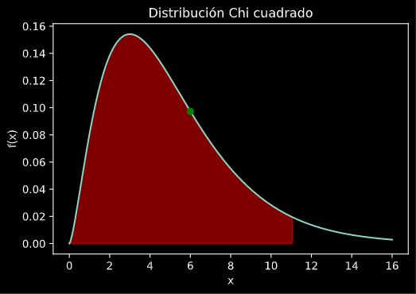

# 02.03 - Interpretación de la prueba de bondad de ajuste

## Modelos de Simualción

---


## Interpretación del Estadístico $\chi^2$

Como sabemos a partir de los valores de $O_i$ y $E_i$ se determina el estadístico $\chi^2$ mediante la ecuación:

$$\chi^2_{prueba} = \sum_{i=1}^{k} \frac{(O_i - E_i)^2}{E_i}$$

Para $n$ grande, $\chi^2_{prueba}$ sigue una distribución $\chi^2$ con $k - s - 1$ grados de libertad. Donde $s$ es el número de parámetros estimados de la distribución propuesta.

Se rechaza la hipótesis nula si: $\chi^2_{prueba} > \chi^2_{k-s-1, \alpha}$

Donde el test de hipótesis es:

- $H_0$: la va $X$ sigue la distribución supuesta con los parámetros estimados.
- $H_A$: la va $X$ sigue otra distribución distinta a la supuesta.

---

Algunas consideraciones sobre la prueba $\chi^2$:

- La fórmula de $\chi^2_{prueba}$ mide la discrepancia entre las frecuencias observadas y esperadas al calcular la suma de las diferencias al cuadrado $(O_i - E_i)^2$, normalizada por las frecuencias esperadas $E_i$.

- La normalización se realiza dividiendo cada término por la frecuencia esperada correspondiente $(E_i)$. Esto asegura que las diferencias entre las frecuencias observadas y esperadas sean ponderadas en función de su importancia relativa.

- Por ejemplo, una diferencia de 10 en frecuencias cuando se esperaban 1000 ocurrencias es menos relevante que la misma diferencia cuando se esperaban solo 20 ocurrencias.

---

**El estadístico Chi-cuadrado sigue aproximadamente una distribución Chi-cuadrado cuando la hipótesis nula es verdadera.**

La distribución Chi-cuadrado es una familia de distribuciones de probabilidad con un parámetro llamado "grados de libertad". En el caso de la prueba de bondad de ajuste, los grados de libertad son generalmente iguales al número de categorías o intervalos menos uno, menos la cantidad de parámetros de la distribución que debieron ser estimados.

Cuando calculamos el valor `p` para la prueba Chi-cuadrado, lo que hacemos es comparar el valor calculado del estadístico $\chi^2_{prueba}$ con los valores críticos de la distribución Chi-cuadrado con los grados de libertad correspondientes.

---

**Un valor `p` pequeño indica que es poco probable que la discrepancia observada entre las frecuencias observadas y esperadas haya ocurrido por azar**, lo que sugiere que hay evidencia para rechazar la hipótesis nula y concluir que los datos no siguen la distribución teórica propuesta.

**El valor p es una medida de la probabilidad de observar un resultado al menos tan extremo como el que se obtuvo en los datos, suponiendo que la hipótesis nula es verdadera.** En otras palabras, **`el valor p nos indica qué tan probable es obtener un resultado como el observado, dado que la hipótesis nula es cierta`**.

---

Para calcular el valor p en la prueba Chi-cuadrado de bondad de ajuste, recordamos que deben seguirse los pasos:

- Calcular el estadístico Chi-cuadrado (χ^2) utilizando la fórmula mencionada anteriormente:

  $χ^2 = Σ[(O_i - E_i)^2 / E_i]$

  Donde O_i son las frecuencias observadas, E_i son las frecuencias esperadas y la suma se realiza sobre todas las categorías o intervalos.

- Determinar los grados de libertad para la prueba. En general, los grados de libertad son igual al número de categorías o intervalos menos uno (k - 1), donde k es el número de categorías o intervalos.

---

- Consultar una tabla de la distribución Chi-cuadrado o utilizar un software estadístico para encontrar el valor p correspondiente al estadístico Chi-cuadrado calculado (χ^2) y los grados de libertad.

La distribución Chi-cuadrado es una función que relaciona los valores del estadístico χ^2 con sus probabilidades asociadas.

**El valor p obtenido representa la probabilidad de obtener un valor del estadístico χ^2 igual o más extremo que el calculado, suponiendo que la hipótesis nula es verdadera.**

---

Por lo general, se establece un nivel de significancia (α) para decidir si se rechaza o no la hipótesis nula. Un nivel de significancia común es 0.05 (5%).

- Si el valor p es menor que el nivel de significancia (p < α), se rechaza la hipótesis nula, lo que sugiere que los datos no se ajustan a la distribución teórica propuesta.

- Por otro lado, si el valor p es mayor que el nivel de significancia (p ≥ α), no se puede rechazar la hipótesis nula, y no hay evidencia suficiente para afirmar que los datos no siguen la distribución teórica.

---
```python
# Distribución chi cuadrado
import numpy as np
import matplotlib.pyplot as plt
from scipy.stats import chi2

k = 5
x = np.linspace(0, 16, 500)
y = chi2.pdf(x, k)
chi_critico = chi2.ppf(0.95, k)
chi_prueba = 6

#calcular el valor de p, la probabilidad de que chi_prueba sea mayor que chi_teorico
_p_prueba = chi2.sf(chi_prueba, k)
_p_critico = chi2.sf(chi_critico, k)

plt.plot(x, y)
plt.fill_between(x, y, where=x < chi_critico, color="red", alpha=0.5)
# plt.fill_between(x, y, where=x > chi_prueba, color="green", alpha=0.5)
plt.xlabel("x")
plt.ylabel("f(x)")
plt.title("Distribución Chi cuadrado")

p = chi2.pdf(chi_prueba, k)
plt.plot(chi_prueba, p , "o", color="green")
plt.show()

print("chi_critico = ", chi_critico)
print("chi_prueba = ", chi_prueba)

print ("p = probabiliad de que el estadístico sea >= chi_critico = ", _p_prueba)
print ("p = probabiliad de que el estadístico sea >= chi_prueba = ", _p_critico)

```

---



---
